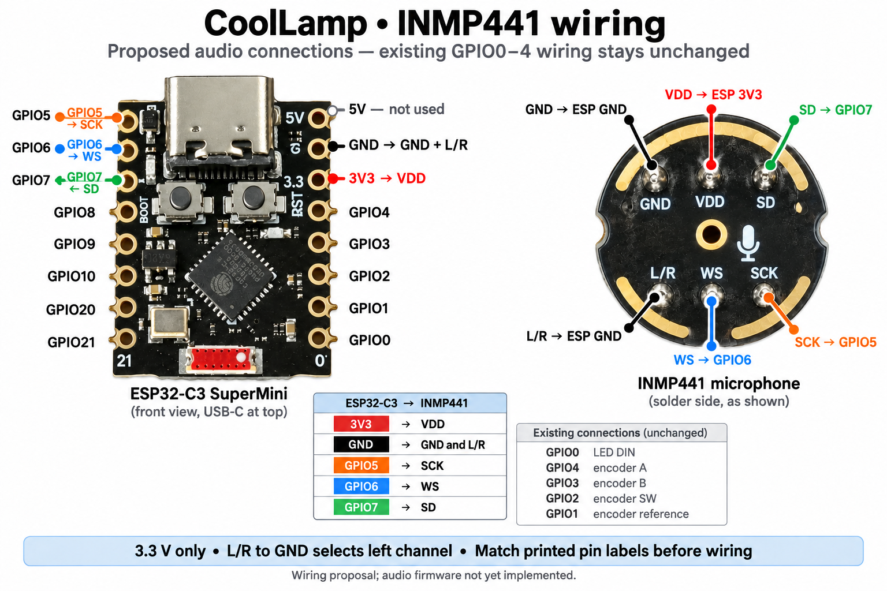

# INMP441 audio input proposal

Status: original engineering proposal for `feature/audio-input`. Firmware implementation and operating instructions now live in [audio-firmware.md](audio-firmware.md); the design discussion below records the proposal. Based on the checked-in firmware and the supplied photographs of the six-pin, round microphone breakout.

[Full-size connection guide](hardware/coollamp-inmp441-wiring.png). AI-rendered from the supplied device photographs; connect by printed terminal names. [Generation prompts](hardware/coollamp-inmp441-wiring-prompt.md).

## Recommendation and wiring

[Microphone and rotary encoder photo guide](hardware/coollamp-microphone-encoder-wiring.png) adds the encoder's rotary-contact, pushbutton, and underside views. Encoder physical connections that the photographs cannot establish are marked for verification; existing prototype wiring stays unchanged. [Image generation prompts](hardware/coollamp-microphone-encoder-wiring-prompt.md).

Keep the ESP32-C3. Add I2S input on GPIO5–7 and begin with amplitude-reactive effects. Validate concurrent LED output, Wi-Fi, Bluetooth, and updates before adding spectrum processing.

Connect by the printed terminal names; the front and back photographs mirror the physical positions.

| Microphone terminal | CoolLamp connection | Purpose |
| --- | --- | --- |
| VDD | Board 3V3 | Fixed regulated supply |
| GND | Board GND | Common ground |
| SCK | GPIO5 | Clock from ESP32 |
| WS | GPIO6 | Left/right clock from ESP32 |
| SD | GPIO7 | Audio data into ESP32 |
| L/R | GND | Select left channel |

These are **proposed new assignments**. Existing assignments in `CoolLamp.ino` remain GPIO0 for LEDs and GPIO4/3/2/1 for encoder A/B/SW/VCC respectively. Do not power the microphone from GPIO1. Existing direct LED data and encoder circuitry remain as prototyped.

The INMP441 accepts 1.62–3.63 V; use 3.3 V, not 5 V. No level shifter or MCLK is needed. Its signed 24-bit Philips I2S output requires 64 clock cycles per stereo frame, even with one microphone. Grounding L/R selects the left slot. The datasheet recommends 100 nF supply decoupling and a 100 kΩ SD-to-ground resistor because SD becomes high impedance outside its active data interval. The photographs show passive components but do not establish their values or connections: verify whether these are already fitted before adding parts. These requirements concern the new microphone, not the existing encoder. Leave the acoustic port unobstructed. [TDK datasheet](https://product.tdk.cn/system/files/dam/doc/product/sw_piezo/mic/mems-mic/data_sheet/inmp441.pdf)

Use short wires, route a ground beside the clocks, and keep microphone wiring away from high-current LED supply runs. Place the microphone ground return so strip current does not flow through it. Mount with access to room sound and some isolation from knob clicks and enclosure vibration. GPIO5–7 availability is established from application code; confirm the corresponding pads on the actual board before soldering. Using them for audio also precludes using those pads for external JTAG.

## Capture and processing design

Use the standard ESP-IDF I2S receive driver (`driver/i2s_std.h`) provided by the project's Arduino ESP32 core, rather than adding a legacy I2S library. The C3 has one I2S peripheral and DMA support; the new and legacy drivers cannot coexist. [Espressif I2S documentation](https://docs.espressif.com/projects/esp-idf/en/v5.5.5/esp32c3/api-reference/peripherals/i2s.html)

Proposed initial configuration:

- ESP32 as clock master; Philips format; 16,000 samples/second.
- Two 32-bit slots per frame: WS = 16 kHz, SCK = 1.024 MHz.
- Initially capture both slots and retain only the left sample. Verify alignment with known input, remove the unused low eight bits, and preserve signed values. A later mono-DMA optimization must retain 64 clocks per frame.
- Four DMA buffers of 256 stereo frames: 8,192 bytes total, 64 ms capacity, with a new block every 16 ms. This is capacity, not a requirement to accumulate 64 ms before processing.
- Discard approximately 300 ms after initial clock startup. The datasheet specifies an initial startup interval of 2^18 clock cycles, approximately 256 ms at the proposed clock. [Startup timing](https://product.tdk.cn/system/files/dam/doc/product/sw_piezo/mic/mems-mic/data_sheet/inmp441.pdf)

Create `LampAudio.h/.cpp` to own the driver, buffers, and a worker task. The task blocks on bounded I2S reads, processes each block once, and publishes a small latest-value snapshot. Suggested fields are sequence number, timestamp, signal level, peak, onset sequence, and capture status. Use a short lock or equivalent safe snapshot exchange. Never mutate LEDs from the capture task or hold a lock during I2S reads.

Start with DC removal, RMS/peak extraction, a configurable noise gate with hysteresis, and smoothed attack/release. Suggested tuning starting points are 10–30 ms attack and 150–300 ms release. Use 64-bit accumulation or deliberately scaled samples to avoid overflow. Keep automatic gain slow and bounded so quiet rooms do not turn into full-brightness noise. Report relative level, not calibrated sound pressure.

Make capture optional and disabled by default for existing lamps. Allocate it when an audio effect or diagnostic session requires it; release it when unused. Account for warm-up on re-entry. Initialization failure must leave existing controls and effects operational. Stale snapshots should decay to silence. I2S running successfully does not prove a microphone is connected; silence and disconnected input cannot be reliably distinguished solely from zero samples.

Budget roughly 14–18 KiB for initial DMA, a 2 KiB read buffer, worker stack, and overhead, before FFT storage. This is an estimate requiring measurement. Start with a modest-priority task and measure stack headroom. The C3 shares one CPU between audio processing, rendering, and communications.

## Changes required by the current code

### Rendering and LED transport

`CoolLamp.ino` advances a virtual effect clock in speed-controlled steps. Do not put acquisition or feature analysis inside that loop: it can execute zero or multiple steps per displayed frame. Render audio effects once per actual frame using the newest feature snapshot and real elapsed time. Consume each onset only once. The speed control should affect visual motion or decay, not sample rate.

Keep the existing brightness, intensity, and power limiting pipeline. Check how audio effects use color options; current custom-color handling has mode-specific behavior.

The build pins FastLED 3.10.5 and Arduino ESP32 3.3.11. Confirm the selected FastLED backend uses RMT and can coexist with the I2S driver. Do not select an I2S LED backend: audio needs the C3's single I2S peripheral. The `FASTLED_ALLOW_INTERRUPTS` definition alone does not establish actual transport or scheduling behavior. Measure dropped capture blocks and frame duration during LED transmission, especially at the supported maximum strip length.

### Effect IDs, persistence, and phone app

Keep IDs 1–38 unchanged. Append new effects starting at 39, updating `MODE_MAX`, `LAMP_EFFECT_COUNT`, dispatch, labels, and category metadata together. Suggested sequence:

1. Sound glow: whole-lamp level response; simplest end-to-end validation.
2. Sound meter: rising level mapped to the lamp's two helix halves.
3. Beat ripple: transient-triggered motion; do not present onset detection as reliable BPM tracking.

There is a concrete migration hazard in `LampColors.ino`: today's 153-byte color blob and 229-byte options blob are accepted through `sizeof(...)`. Increasing the effect count changes those sizes and rejects current saved data unless migration is extended. Explicitly support the current and previously supported layouts, validate bounds, preserve all existing entries, and initialize only new entries. Test migration before saving expanded blobs. Downgrading to current firmware will also require consideration because it will not accept the expanded layouts.

Store microphone enablement, gain, and gate settings under a separate versioned NVS key rather than changing the existing settings struct without migration.

Wi-Fi and BLE already expose dynamic effect catalogs. Preserve the older BLE capability views (37 and 38 effects) and the current full-catalog negotiation. Maintain contiguous IDs; do not remove individual catalog entries based on microphone detection. Existing lamps should continue to boot and render without audio hardware.

`mobile/src/catalog.js` currently recognizes only `calm`, `fire`, and `color`; other categories become `other`. Update it and the category controls in `mobile/index.html` (handled by `mobile/src/main.js`) for an Audio category. New catalog names can already appear through dynamic discovery, but audio configuration/status requires explicit app and firmware support. Keep raw audio local; send only low-rate status/features if needed.

### Updates and memory

The firmware already reduces Wi-Fi/BLE allocations and stages HTTPS updates in an 8 KiB-stack worker. Audio must cooperate with that memory budget.

`lampIsUpdating()` does not include the remote update-check phase, while `lampRemoteUpdateBusy()` does. Merely checking the former in the render loop is insufficient. `LampUpdate.cpp` can notify the HTTPS worker immediately after entering `UPDATE_CHECKING`; introduce an explicit audio-quiesce handshake before that worker starts TLS. Release DMA and optional analysis allocations when necessary, rather than assuming stopping the clock frees memory. Coordinate local OTA as well, then restore audio after a completed check or failed update when appropriate.

Record minimum free heap and largest free block during capture, Wi-Fi/BLE activity, and OTA. Historical firmware measurements are not a substitute for testing the new build.

## Development and validation sequence

1. Implement gated I2S capture and USB diagnostics before adding effects. Confirm WS/SCK frequency, left-slot selection, signed sample alignment, quiet-room baseline, clipping, and response to a tone/clap. Inspect the breakout's resistor/decoupling network.
2. Implement sound glow, saved-data migration, and optional audio configuration. Test silence, impulses, constant offsets, full-scale input, stale samples, and effect-speed independence using synthetic samples. Check existing effect IDs and saved settings survive upgrade.
3. Test capture with normal and maximum LED counts, bright effects, encoder interaction, Wi-Fi, BLE, pairing, and identification. Compare the noise baseline with LEDs off/on and under radio traffic. Measure capture overruns, frame timing, task stack, heap, and end-to-end response; aim initially for less than 50 ms after warm-up.
4. Test remote version checks, failed HTTPS requests, successful remote OTA, and local OTA while an audio effect is selected. Verify memory is released before TLS allocations and the lamp recovers cleanly.
5. Add sound meter and transient effects. Then evaluate a 512-sample window with a 256-sample hop for spectrum effects: at 16 kHz that is a 32 ms window, 16 ms update interval, and 31.25 Hz bin spacing. Compare a small filter bank with FFT processing and choose based on measured CPU/RAM use.

This review does not establish electrical operation, driver coexistence, measured resource usage, or hardware latency. No firmware was changed or flashed for this proposal.
