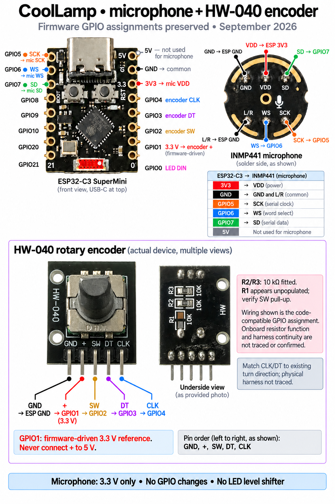

# CoolLamp schematic and wiring

Updated 2026-09-30 for the owner's **HW-040 rotary encoder breakout**. Firmware and
GPIO assignments are unchanged. This replaces the earlier bare-encoder drawings.

- [Photographic wiring guide](hardware/coollamp-microphone-encoder-wiring.png)
- [Connection schematic](hardware/coollamp-schematic.svg)
- [Wiring diagram](hardware/coollamp-wiring.svg)
- [Editable KiCad PCB schematic](../hardware/pcb/rev-a/CoolLamp-RevA.kicad_sch)
- [KiCad PDF](../hardware/pcb/rev-a/review/CoolLamp-RevA.pdf)
- Owner reference photos: [front](hardware/reference/hw040-front.jpg), [underside](hardware/reference/hw040-underside.jpg)

## Encoder connections

With the shaft facing you and the five-pin header pointing down, the front photo
shows **GND, +, SW, DT, CLK**, left to right. The schematic uses that order for
interface pin numbering 1–5; a manufacturing connector footprint is still pending.

| HW-040 header | ESP32-C3 connection | Firmware role |
| --- | --- | --- |
| 1 — GND | GND | Common ground |
| 2 — + | GPIO1 | `DO_ENCODER_VCC`, reference driven HIGH by library |
| 3 — SW | GPIO2 | `DI_ENCODER_SW`, button |
| 4 — DT | GPIO3 | `DI_ENCODER_B`, phase B |
| 5 — CLK | GPIO4 | `DI_ENCODER_A`, phase A |

This is the code-compatible hookup, not a continuity measurement of the owner's
assembled harness. Check rotation direction against the working prototype. GPIO1
provides a 3.3 V logic reference for the breakout's bias network, not general load
power. Do not connect the breakout `+` pin to 5 V or tie GPIO1 to a separate supply.

## What the resistors establish

The underside photo shows R2 and R3 populated with `103` markings (10 kΩ). R1
appears unpopulated. The images do not prove the trace routing, which signal each
resistor pulls up, or that SW has a fitted pull-up. The module is represented as a
five-pin assembly, with those observations noted, rather than an invented internal
resistor circuit.

Firmware 1.9.1 uses `EncoderType::SW_FLOAT`: the installed library selects plain
`INPUT` for A/B and `INPUT_PULLUP` for the GPIO2 switch. Initialization still drives
GPIO1 HIGH. This supplies a defined released button level even if R1 is absent,
which matters for the ten-second factory-reset hold. Earlier HAS_PULLUP builds
used plain INPUT for all three signals. With the module unpowered and
disconnected, verify resistance from `+` to CLK/DT and SW-to-GND continuity while
pressing the button; the photographed resistor routing is still unconfirmed.

There are no added discrete resistors in these prototype drawings. The newly
identified resistors are **already on the breakout**; this supersedes older text
that described the encoder itself as resistor-free. Optional R6–R8 on the custom
PCB draft remain DNP and are not claimed to be installed prototype parts.

## Other fixed connections

| Device terminal | ESP32-C3 connection |
| --- | --- |
| WS2812B DIN | GPIO0, direct 3.3 V data as in working prototype |
| WS2812B 5V / GND | Shared regulated 5 V supply / common GND |
| INMP441 VDD | 3V3 |
| INMP441 GND and L/R | GND; left audio channel |
| INMP441 SCK | GPIO5 |
| INMP441 WS | GPIO6 |
| INMP441 SD | GPIO7 |

No LED level shifter is added. The strip remains one continuous chain; its final
DOUT is unconnected. LED count and center remain configurable. The 500 mA default
LED software budget excludes controller consumption and is not hardware current
protection. The owner uses a 5 V / 2.4 A wall supply and a four-wire panel USB-C
inlet. Keep the existing power arrangement; the diagrams don't authorize combining
independent USB and external 5 V supplies.

## PCB and mechanical status

The A1 KiCad draft now connects ENC1 as the HW-040 assembly, including GND and the
GPIO1 reference. It is **not fabrication-ready**: connector/assembly mounting,
resistor routing, SW bias and button-held boot behavior still need checking. The
previous bare-encoder 4.5 mm mounting-plane study is not a verified mounting stack
for this breakout. Remeasure its board outline, mounting holes, header clearance
and panel-to-board distance before updating the insert or PCB outline.

The custom PCB's requested onboard microphone selection is a separate open item;
J3 is still its earlier placeholder interface. This encoder update does not resolve
or change that pending design choice.

## Verification

KiCad 10.0.6 exported the updated schematic, PDF, SVG and netlist. ERC reported
**zero errors and zero warnings**. The netlist audit checks the eight fixed GPIOs,
HW-040 header, USB and module grounds. This validates connectivity, not physical
measurements, manufacturing suitability or resistor function. The photographic
guide was generated with the built-in image tool and visually checked; the SVGs
are deterministic, editable drawings generated by `tools/hardware/draw-wiring.py`.
